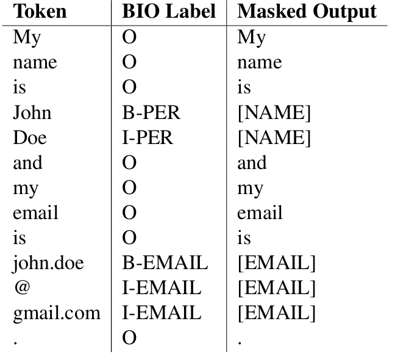
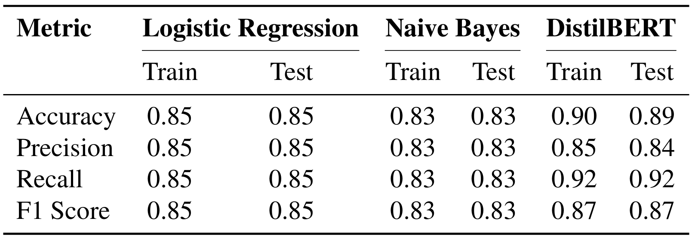

# 🔐 PII Detection & Privacy Risk Classification in Text  
**An NLP project for identifying sensitive information and assessing privacy risk in unstructured text**

---

## 📌 Project Overview

This project focuses on the application of **Natural Language Processing (NLP)** and **Machine Learning** techniques to detect **Personally Identifiable Information (PII)** in text and classify documents according to their **privacy risk level**.

With the increasing volume of unstructured textual data (e.g., emails, chat logs, support tickets), organizations face growing challenges in ensuring **data privacy compliance** (e.g., GDPR). Manual inspection is not scalable, making automated solutions essential.

The project addresses this challenge by building a pipeline that:

- detects PII at the **token level**  
- transforms PII signals into **document-level risk scores**  
- classifies documents into **low-risk vs high-risk categories**  

The central research objective is:

> *How accurately can privacy risk be inferred from unstructured text using NLP and machine learning models?*

---

## 🧠 Methodological Approach

The project follows a structured NLP pipeline:

1. Dataset preparation and cleaning  
2. Exploratory Data Analysis (EDA)  
3. Text preprocessing and normalization  
4. PII detection using BIO tagging  
5. Risk score computation based on PII types  
6. Supervised classification (Low vs High risk)  
7. Model evaluation and comparison  

---

## 🏷️ PII Detection with BIO Tagging

PII entities are identified using the **BIO (Beginning–Inside–Outside)** tagging scheme, a standard approach in Named Entity Recognition (NER).

- **B-** → beginning of an entity  
- **I-** → continuation of the entity  
- **O** → non-PII token  

### Example

<p align="center">
  
</p>

This tagging enables precise identification of sensitive information such as:

- names  
- emails  
- phone numbers  
- credentials  

Detected entities are then **masked** and used to compute risk scores.

---

## ⚙️ Risk Scoring & Classification

Each document is assigned a **risk score** based on:

- frequency of detected PII  
- sensitivity of each PII type (weighted)  

Examples:
- Low sensitivity → usernames, timestamps  
- High sensitivity → passwords, financial identifiers  

The final score is converted into a **binary classification**:

- **Low Risk**
- **High Risk**

This enables automated decision-making in real-world systems (e.g., prioritizing sensitive documents).

---

## 🤖 Models Implemented

Three modeling approaches were evaluated:

### 1. TF-IDF + Logistic Regression
- Sparse vector representation  
- Interpretable baseline model  
- Strong and stable performance  

### 2. TF-IDF + Naive Bayes
- Probabilistic classifier  
- Efficient and lightweight  
- Slightly lower performance than Logistic Regression  

### 3. DistilBERT (Transformer-based)
- Context-aware language model  
- Token-level prediction → document-level risk  
- Best overall performance  

---

## 📊 Model Evaluation

The models were evaluated using standard classification metrics:

- Accuracy  
- Precision  
- Recall  
- F1-score  

### Evaluation Results



### Key Insights:

- **DistilBERT** achieves the highest recall → best at detecting sensitive content  
- **Logistic Regression** provides strong and balanced baseline performance  
- **Naive Bayes** remains efficient but slightly less accurate  

The evaluation prioritizes **recall**, as missing sensitive information (false negatives) is more critical than false positives in privacy contexts.

---

## 🔍 Key Findings

- Transformer-based models significantly outperform traditional approaches in **context understanding**  
- PII distribution is **highly uneven**, with sensitive entities being rare but critical  
- Risk classification benefits from combining:
  - token-level detection  
  - document-level aggregation  

- There is a natural **class imbalance**, reflecting real-world scenarios where high-risk cases are less frequent but more important  

---

## 💡 Practical Implications

### Short-term
- Automated detection of sensitive information in text  
- Support for privacy compliance workflows  

### Mid-term
- Integration into enterprise systems (e.g., email, CRM, support platforms)  
- Risk-based routing and prioritization  

### Long-term
- Deployment as a real-time API for:
  - anonymization  
  - redaction  
  - secure data handling  

---

## 🗂️ Repository Structure

```text
.
├── pii-risk-classification.ipynb
├── Images/
│   ├── Evaluation-metrics.png
│   └── BIO-tag-examples.png
└── README.md
```

---

## ⚙️ Tools & Technologies

* **Python** → core implementation
* **Scikit-learn** → TF-IDF, Logistic Regression, Naive Bayes
* **Transformers (HuggingFace)** → DistilBERT
* **spaCy** → text preprocessing and lemmatization
* **Pandas / NumPy** → data manipulation

---

## 🚀 Conclusion

This project demonstrates how **NLP and machine learning** can be effectively applied to **privacy risk detection in unstructured text**.

The results highlight that:

* traditional models provide strong baselines
* transformer-based models deliver superior performance in complex scenarios

Overall, the study shows that **privacy risk is not directly observable**, but can be reliably inferred through structured processing of textual data.
